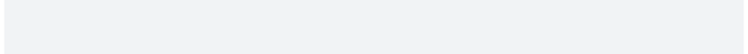

# Progression Handler: Progress Reported via 'progress' Progress Bars (Text) in the Terminal

A progression handler for
[`progress::progress_bar()`](http://r-lib.github.io/progress/reference/progress_bar.md).

## Usage

``` r
handler_progress(
  format = NULL,
  show_after = 0,
  intrusiveness = getOption("progressr.intrusiveness.terminal", 1),
  target = "terminal",
  type = c("default", "steps", "percent", "time"),
  ...
)
```

## Arguments

- format:

  (character string) The format of the progress bar. If `NULL`, the
  format is determined by the `type` argument.

- show_after:

  (numeric) Number of seconds to wait before displaying the progress
  bar.

- intrusiveness:

  (numeric) A non-negative scalar on how intrusive (disruptive) the
  reporter to the user.

- target:

  (character vector) Specifies where progression updates are rendered.

- type:

  (character) The type of progress bar to display, which controls the
  default `format` passed to
  [`progress::progress_bar()`](http://r-lib.github.io/progress/reference/progress_bar.md).
  If `"default"`, the format string is
  `":spin [:bar] :percent :message"`. If `"steps"`, the format string is
  `":spin [:bar] :current/:total :message"`. If `"percent"`, the format
  string is `":spin [:bar] :percent :message"`. If `"time"`, the format
  string is
  `"[:elapsed] :spin [:bar] :percent [:current/:total] (ETA: :eta) :message"`.
  For the meaning of these format variables, see
  [progress::progress_bar](http://r-lib.github.io/progress/reference/progress_bar.md).
  This argument is ignored if `format` is explicitly specified.

- ...:

  Additional arguments passed to
  [`progress::progress_bar()`](http://r-lib.github.io/progress/reference/progress_bar.md)
  and
  [`make_progression_handler()`](https://progressr.futureverse.org/reference/make_progression_handler.md).

## Value

A function of class `progression_handler` that takes a
[progression](https://progressr.futureverse.org/reference/progression.md)
condition as its first and only argument.

## Requirements

This progression handler requires the progress package.

## Appearance

Below are a few examples on how to use and customize this progress
handler. In all cases, we use `handlers(global = TRUE)`.

    library(progressr)
    handlers("progress")
    y <- slow_sum_p(1:25)



    library(progressr)
    handlers(handler_progress(complete = "#"))
    y <- slow_sum_p(1:25)


    library(progressr)
    handlers(handler_progress(type = "steps"))
    y <- slow_sum_p(1:25)


    library(progressr)
    handlers(handler_progress(type = "percent"))
    y <- slow_sum_p(1:25)


    library(progressr)
    handlers(handler_progress(type = "time"))
    y <- slow_sum_p(1:25)


    library(progressr)
    handlers(handler_progress(format = ":spin [:bar] :percent :message"))
    y <- slow_sum_p(1:25)


    library(progressr)
    handlers(handler_progress(format = ":percent [:bar] :eta :message"))
    y <- slow_sum_p(1:25)


## Examples

``` r
if (requireNamespace("progress", quietly = TRUE)) {

  handlers(handler_progress(format = ":spin [:bar] :percent :message"))
  with_progress({ y <- slow_sum_p(1:10) })
  print(y)
  
}
#> M: Added value 1
#> M: Added value 2
#> M: Added value 3
#> M: Added value 4
#> M: Added value 5
#> M: Added value 6
#> M: Added value 7
#> M: Added value 8
#> M: Added value 9
#> M: Added value 10
#> [1] 55
```
